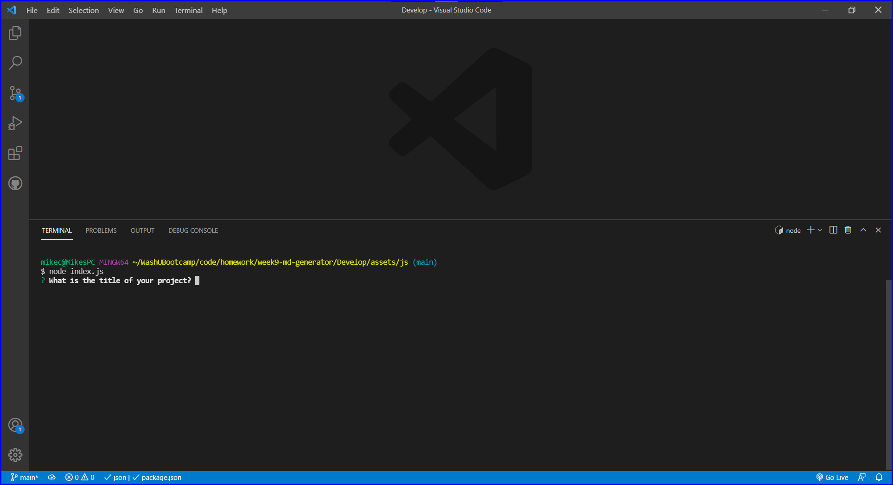

# README Generator

## Table of Contents

I. [Description](#description)  
II. [Install Instructions](#install-instructions)  
III. [Usage Information](#usage-information)  
IV. [Contribution Guidelines](#contribution-guidelines)  
V. [Testing Instructions](#testing-instructions)  
VI. [Contact](#contact)  
VII. [License](#license)

## <a id="description">I. Description</a>

This project was built to help simplify creating a README file for any future projects.
By using this I can create the basic structure of my README by answering the prompts, so I can spend less time formatting and trying to remember what needs to be added. I learned a bit more about how markdown works with this project, and got to use the NodeJS Inquirer package for the first time (in a real project).

## <a id="install-instructions">II. Install Instructions</a>

Fork this repository and clone it to your local machine. If you don't have Inquirer installed you will need to do that (Open the terminal and run 'npm i').

## <a id="usage-information">III. Usage Information</a>

Open the terminal and run this using 'node index.js'. You'll be presented with a series of prompts, gathering information to build your README. Once all prompts are answered you'll have a brand new README that you can copy and paste into your new project. The generated README will be in 'assets/js/', this is the one you should copy/paste. Please leave the README in the root directory (this README) for reference.

### Project Screenshot

### Credits

This Project uses NodeJS, <a href="https://www.npmjs.com/package/inquirer" target="_blank">Inquirer</a>, and badges from <a href="https://shields.io/" target="_blank">shields.io</a>

## <a id="contribution-guidelines">IV. Contribution Guidelines</a>

If you would like to contribute to this project email me at ChampionMike42@gmail.com. Let's collaborate!

## <a id="testing-instructions">V. Testing Instructions</a>

No testing instructinos at this time.

## <a id="contact">VI. Contact</a>

### email

ChampionMike42@gmail.com

### GitHub

MikeChampion

## <a id="license">VII. License</a>

Copyright 2021 Mike Champion
 
        
Permission is hereby granted, free of charge, to any person obtaining a copy of this software and associated documentation files (the "Software"), to deal in the Software without restriction, including without limitation the rights to use, copy, modify, merge, publish, distribute, sublicense, and/or sell copies of the Software, and to permit persons to whom the Software is furnished to do so, subject to the following conditions:

        
The above copyright notice and this permission notice shall be included in all copies or substantial portions of the Software.

        
THE SOFTWARE IS PROVIDED "AS IS", WITHOUT WARRANTY OF ANY KIND, EXPRESS OR IMPLIED, INCLUDING BUT NOT LIMITED TO THE WARRANTIES OF MERCHANTABILITY, FITNESS FOR A PARTICULAR PURPOSE AND NONINFRINGEMENT. IN NO EVENT SHALL THE AUTHORS OR COPYRIGHT HOLDERS BE LIABLE FOR ANY CLAIM, DAMAGES OR OTHER LIABILITY, WHETHER IN AN ACTION OF CONTRACT, TORT OR OTHERWISE, ARISING FROM, OUT OF OR IN CONNECTION WITH THE SOFTWARE OR THE USE OR OTHER DEALINGS IN THE SOFTWARE.

